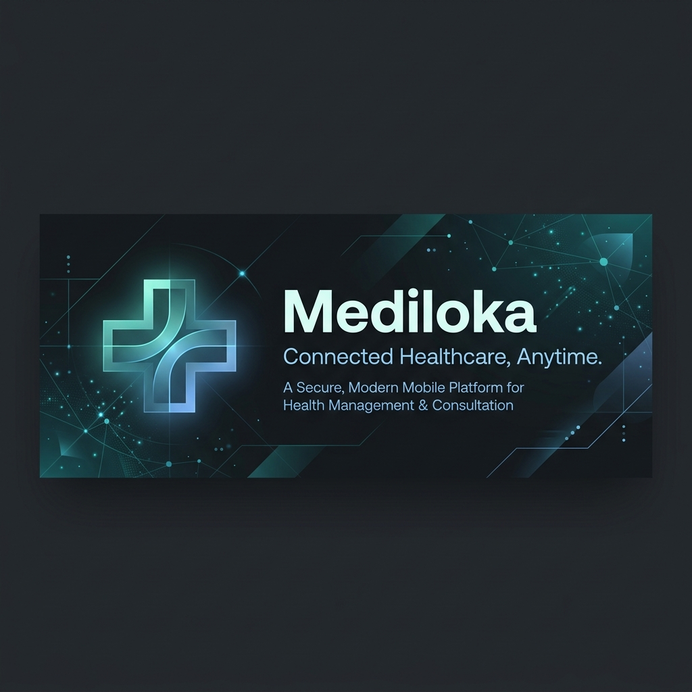

# Mediloka 🏥



<p align="center">
  
  
  
  
  
</p>

---

## 🌟 Overview

**Mediloka** is a smart mobile application designed to improve healthcare logistics and accessibility in real-time. Originally developed and presented for **HACKATHON MANADO 2022**, the app addresses critical healthcare coordination challenges by providing users with instant, transparent information on the availability of essential health facilities.

> **Indonesian:**  
> **Mediloka** adalah aplikasi mobile pintar yang dirancang untuk meningkatkan efisiensi logistik dan aksesibilitas layanan kesehatan secara real-time. Dibuat dan dipresentasikan khusus untuk **HACKATHON MANADO 2022**, aplikasi ini memecahkan masalah koordinasi layanan kesehatan penting dengan menyediakan informasi instan dan transparan mengenai ketersediaan fasilitas kesehatan esensial bagi masyarakat.

---

## ✨ Key Features / Fitur Utama

- 🏥 **Hospital Bed Availability (Ketersediaan Kamar RS)**  
  Real-time tracking of available hospital beds and ICU rooms in local health facilities to avoid waiting times in emergencies.
- 🩸 **Blood Bank Tracker (Pencarian Kantong Darah)**  
  Check real-time stock levels of various blood types across local donor centers and search for immediate donors.
- 🚑 **Ambulance Dispatch & Status (Layanan Ambulans)**  
  Locate, request, and track nearest available ambulances for immediate emergency transport.
- 🗺️ **Nearby Healthcare Map (Peta Faskes Terdekat)**  
  Interactive mapping using Google Maps API to search and locate the nearest hospitals, clinics, and pharmacies.
- 🔐 **Secure Authentication (Autentikasi Pengguna)**  
  Personalized experience with registration, login, and password recovery powered by Firebase Auth.

---

## 🛠️ Technology Stack & Libraries

- **Frontend Framework:** [Flutter](https://flutter.dev/) (Dart)
- **Design & Prototyping:** FlutterFlow
- **Backend Database & Storage:** [Google Firebase](https://firebase.google.com/)
  - **Cloud Firestore:** Real-time synchronized database for medical inventory and facility availability status.
  - **Firebase Authentication:** Secure and easy email/password authentication.
  - **Firebase Storage:** Cloud storage for profile images and document uploads.
- **Geographic Services:** Google Maps SDK & Geolocator (GPS tracking for nearest facilities).

---

## 📂 Project Structure

Below is an overview of the key directories in the `lib` folder:

```text
lib/
├── auth/                 # Firebase authentication helpers and providers
├── backend/              # Firestore schemas, database queries, and structures
│   ├── firebase_storage  # File upload utils
│   └── schema            # Auto-generated schemas for rooms, blood bags, etc.
├── components/           # Reusable UI widgets and custom components
├── flutter_flow/         # Theme configurations, utility functions, and internationalization
├── home_page/            # App dashboard and main landing view
├── nearby_hospital/      # Local health facility search and map views
├── page_ambulance/       # Ambulance request and status tracking views
├── page_darah/           # Blood donor and blood type stock tracking
├── page_ruangan/         # Detailed hospital room lists and bookings
├── login_page/           # User login forms
├── register_page/        # User registration screens
└── main.dart             # Application initialization and routing
```

---

## 🚀 Getting Started

Follow these instructions to set up and run the project locally.

### Prerequisites
- [Flutter SDK](https://docs.flutter.dev/get-started/install) (Compatible with Dart 2.x, see note below)
- Android Studio / VS Code
- A Firebase Project (Google Cloud)

> [!IMPORTANT]  
> **Dart SDK Compatibility:** This project was developed in 2022 prior to Dart's sound null-safety enforcement. It targets Dart SDK `>=2.7.0 <3.0.0`. To run or build the project, you must use a compatible Flutter SDK version bundled with Dart 2.x (e.g., Flutter 2.10.x to Flutter 3.0.x) or run it using a version manager like `fvm` configured with a compatible SDK.


### Setup Steps
1. **Clone the repository:**
   ```bash
   git clone https://github.com/aditzeb/mediloka.git
   cd mediloka
   ```

2. **Install dependencies:**
   ```bash
   flutter pub get
   ```

3. **Configure Firebase:**
   Create a new project on the [Firebase Console](https://console.firebase.google.com/) and download the platform configuration files:
   - Place `google-services.json` in `android/app/`
   - Place `GoogleService-Info.plist` in `ios/Runner/`
   - Enable **Firebase Authentication** (Email/Password) and **Cloud Firestore** in your console.

4. **Run the application:**
   ```bash
   flutter run
   ```

---

## 📄 License

This project is open-source and licensed under the [MIT License](LICENSE). Feel free to use, modify, and distribute it for educational or non-commercial purposes.

## 🏆 Hackathon Context

This project was built during **HACKATHON MANADO 2022** in Manado, North Sulawesi, Indonesia, aimed at utilizing cloud technologies and mobile apps to improve public health service delivery.
